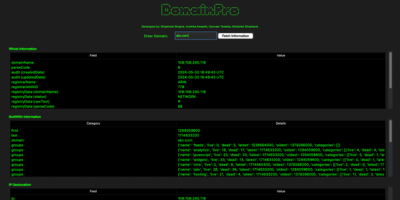
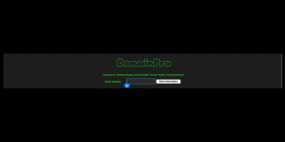
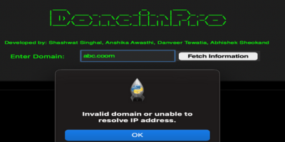
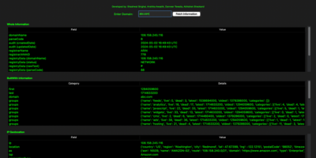
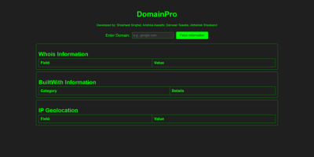
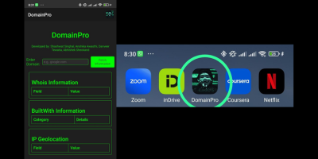

# DomainPro

## Abstract

The project's goal is to provide an advanced Domain/IP Recon Tool based on a graphical user interface (GUI) and suitable for Open-Source Intelligence (OSINT) investigations. With this tool's help, users will have access to extensive information about domain names and IPs, including metadata, Internet service provider (ISP) details, and geographic information. Future developments will incorporate Application Programming Interfaces (APIs) from various internet reconnaissance platforms, including BuiltWith, IP2Geolocation, and WHOIS, to enhance the tool's functionality.

## Features

- **Comprehensive Information Retrieval:** Extracts detailed information about domain names and IPs, such as registration date, update timestamps, country, state, organization contact, name servers, and contact email.
- **User-Friendly GUI:** The design ensures a simple and efficient user experience, suitable for both novice and experienced users.
- **Integration with Multiple APIs:** Current and future integration with platforms like BuiltWith, IP2Geolocation, and WHOIS, with plans to add Nessus, Shodan, crt.sh, and Wappalyzer.

## SWOT Analysis

### Strengths
1. **Comprehensive Information Retrieval:** Extracts detailed domain/IP information, including registration dates, update timestamps, country, state, organization contact, name servers, and contact email.
2. **User-Friendly GUI:** Enhances user experience by providing a simple, efficient means of interaction, catering to both novice and experienced users.

### Weaknesses
1. **Dependency on External APIs:** Relies on external libraries like Tkinter, Requests, and Pyfiglet, which may introduce issues based on changes or limitations in these APIs.
2. **Limited CLI:** The absence of a command line interface may limit its accessibility for users who prefer CLI-based tools. A CLI tool could help users track background processes using verbose mode.

### Opportunities
1. **Integration of Additional APIs:** Expanding capabilities by integrating APIs from other platforms like Nessus, Shodan, crt.sh, and Wappalyzer could enhance the range of information provided.
2. **Enhanced Data Visualization:** Introducing graphical representations such as maps or charts to convey complex information more effectively.

### Threats
1. **Security and Privacy Concerns:** Dealing with sensitive information poses a constant threat of misuse. Measures must be taken to protect user data.
2. **Rapid Technological Changes:** The dynamic nature of technology and APIs may pose challenges in keeping the tool updated. Regular updates and adaptability are essential.
3. **Legal and Compliance Issues:** Misuse of the tool for malicious activities may lead to legal ramifications, including compliance with CERT-In and SPDI Rules.

## Test Cases

### Search Domain Name

#### If Fails

#### If Passes

## Additional Information

### Website
#### We have a dedicated website for the tool. 

### Mobile Application
#### Available for Android.

### Desktop GUI
#### Supported on both Mac and Windows platforms.
